# Schedule PNU
[](https://www.dartlang.org/)
[](https://flutter.io/) [](https://opensource.org/licenses/Apache-2.0)

This app it's a simple flutter project for checking PNU students or teacher schedule. You can try it on your Android or iPhone right now.

## View
<table align="left" width="100%">
  <tbody>
    <tr>
      <td colspan="1">  </td>
      <td colspan="1"> 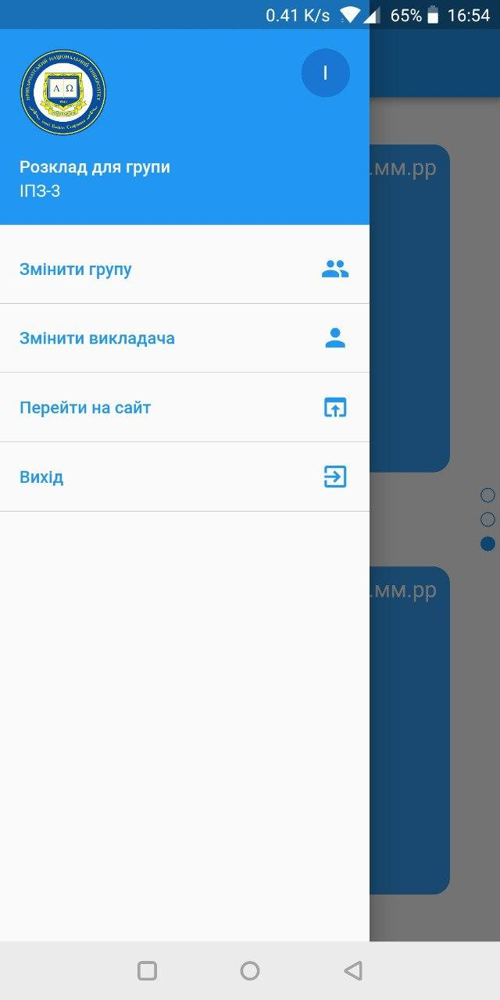 </td>
    </tr>
    <tr>
        <td> 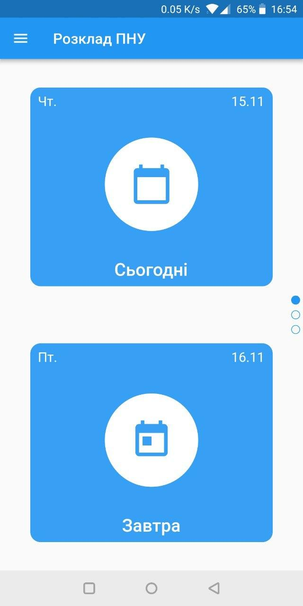 </td>
        <td> 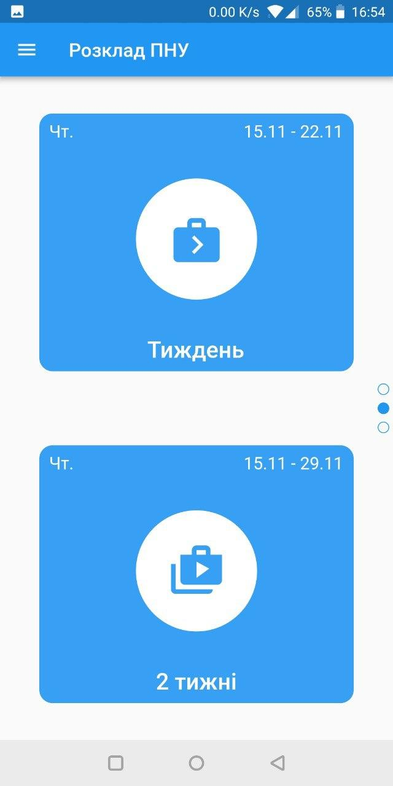 </td>
        <td> 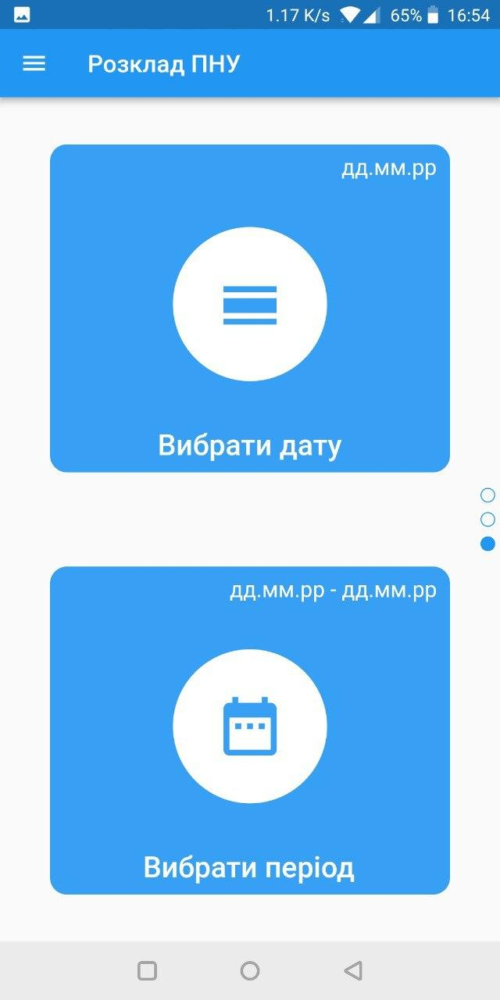 </td>
    </tr>
    <tr>
          <td> 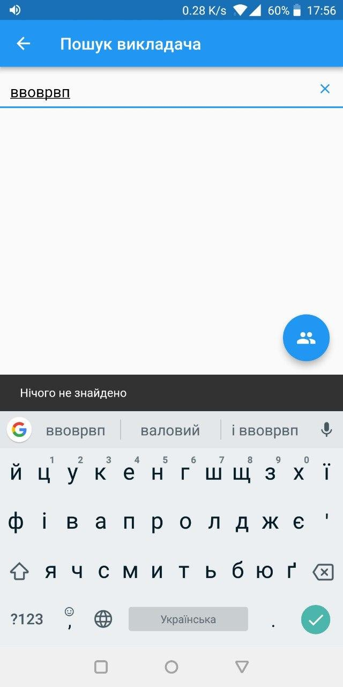 </td>
          <td> 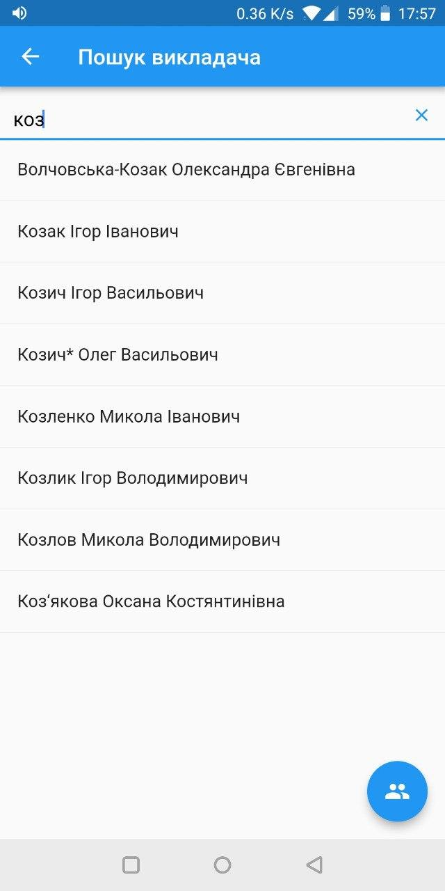 </td>
          <td> 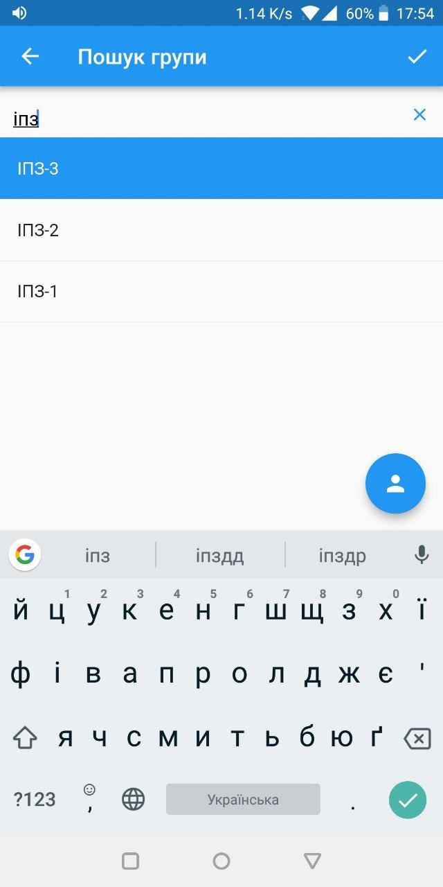 </td>
          <td> 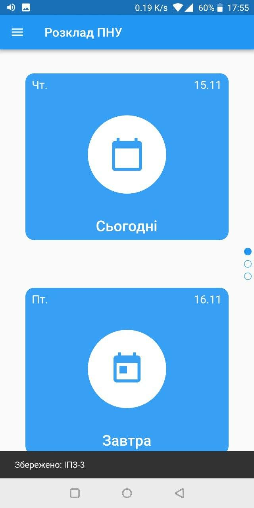 </td>
    </tr>
    <tr>
          <td> 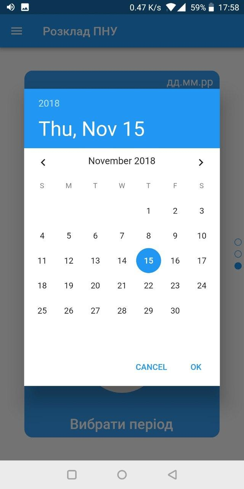 </td>
          <td> 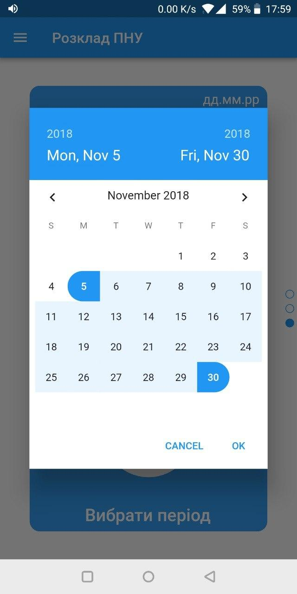 </td>
          <td> 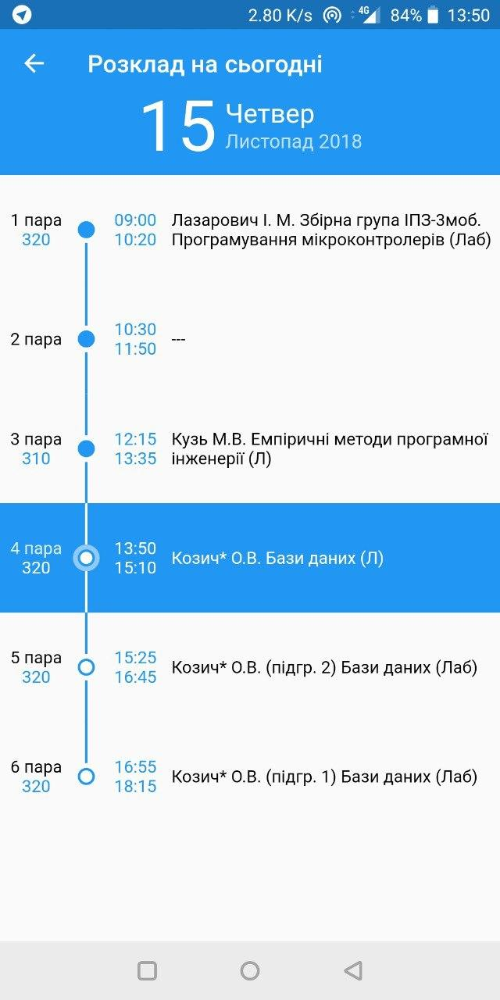 </td>
          <td> 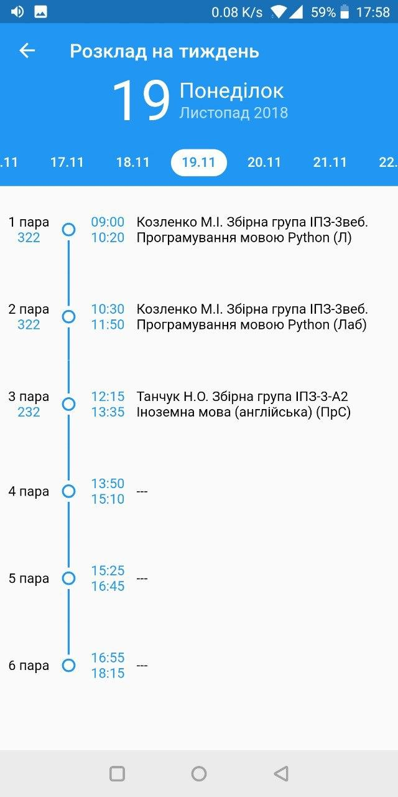 </td>
    </tr>
  </tbody>
</table>

## Version
0.11
## Built With
* Flutter [v0.9.4](https://github.com/flutter/flutter/wiki/Changelog)
* Dart [v2.1.0](https://www.dartlang.org/tools/sdk)

## How to install
Check available apk or ipa files into [realises](https://github.com/rostIvan/schedule_pnu/releases).

If it isn't contain necessary files that you need you can just install using the next steps:

1. Install [flutter](https://flutter.io/docs/get-started/install)
2. Change flutter version
``` bash
cd flutter
git checkout v'0.9.4'
```
3. Clone app with HTTPS
``` bash
git clone https://github.com/rostIvan/schedule_pnu.git
```
4. Install on phone using flutter
``` bash
cd lessons_schedule_pnu
flutter run # run debug version
flutter build apk --release && flutter install # install realease version
```

## Contributing
If you wanna help to improve this app you can send your pull requests or open issues. Feel free to connect me whenever you want.
